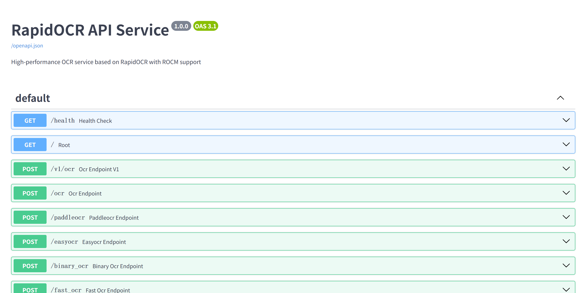

# PaddleOCR API Service

基于 PaddleOCR 模型构建的高性能 OCR API 服务，使用 FastAPI 提供 RESTful 接口，支持在曙光 K100AI（ROCM 显卡）上部署。



## 技术栈

- **推理框架**: ONNX Runtime，支持 ROCM GPU 加速
- **Web 框架**: FastAPI
- **对应 PaddleOCR 版本**: release/2.7 分支（PP-OCRv4）
- **对应 RapidOCR 版本**: https://github.com/RapidAI/RapidOCR/tree/main/python/rapidocr  在这个基础上增加了ROCM硬件的支持

## 模型版本信息

| 模型类型 | 模型文件 | 版本 | 说明 |
|---------|---------|------|------|
| **检测模型** | `ch_PP-OCRv4_det_infer.onnx` | PP-OCRv4 | 文本检测模型，发布于 2023年8月 |
| **识别模型** | `ch_PP-OCRv4_rec_infer.onnx` | PP-OCRv4 | 文本识别模型，发布于 2023年8月 |
| **分类模型** | `ch_ppocr_mobile_v2.0_cls_infer.onnx` | PP-OCRv2.0 | 文本方向分类模型（较旧版本） |

## 特性

- **高性能**: 基于RapidOCR和ONNX Runtime，支持ROCM GPU加速
- **多接口**: 提供PaddleOCR兼容、EasyOCR兼容等多种接口
- **文件上传**: 支持直接图片文件上传和base64编码图片, 支持pdf多页识别
- **日志**: 详细的请求日志和错误处理

## 快速开始

### 1. 安装依赖

```bash
# 创建虚拟环境（推荐）
python -m venv venv
venv\Scripts\activate  

# 安装依赖
pip install -r requirements.txt
```

### 2. 启动服务

#### 开发/测试环境（使用 uvicorn）

```bash
# 使用 run.py（推荐，支持热重载）
python run.py
```

#### 生产环境（使用 gunicorn）

```bash
# 使用 gunicorn + uvicorn worker, 参考项目中 docker-entrypoint.sh
gunicorn -w 4 -k uvicorn.workers.UvicornWorker --bind 0.0.0.0:7850 wsgi:application
```

### 3. 测试服务

```bash
# 访问swagger页面
http://localhost:7850/docs

# 使用测试脚本
python ocr_server_test.py
```

## 配置说明

### 环境变量配置

服务支持通过环境变量进行配置，主要配置项包括：

```bash
# 服务配置
export OCR_PORT=7861                    # 服务端口
export OCR_WORK_COUNT=1                 # worker数量
export OCR_HOST="0.0.0.0"              # 监听地址

# GPU配置
export OCR_USE_GPU=true                 # 是否使用GPU
export OCR_HIP_INDEX=0                  # ROCM GPU设备ID

# 模型配置
export OCR_MODEL_CONFIG_PATH="./rapidocr_onnxruntime/config.yaml"

# OCR参数
export OCR_TEXT_SCORE=0.5               # 文本置信度阈值
export OCR_BOX_THRESH=0.5               # 检测框阈值
export OCR_UNCLIP_RATIO=1.6             # 文本框扩展比例

# 文件上传配置
export OCR_MAX_FILE_SIZE=10485760       # 最大文件大小（10MB）
export OCR_MAX_IMAGE_WIDTH=4096         # 最大图片宽度
export OCR_MAX_IMAGE_HEIGHT=4096        # 最大图片高度
```


## API接口

### 1. 健康检查

```bash
GET /health
```

响应示例：
```json
{
  "status": "healthy",
  "model": "RapidOCR",
  "model_version": "v4",
  "gpu_support": true,
  "providers": ["ROCMExecutionProvider", "CPUExecutionProvider"],
  "environment": "production",
  "supported_languages": ["ch", "en"]
}
```

### 2. PaddleOCR兼容接口

```bash
POST /paddleocr
```

请求体：
```json
{
  "image": "base64_encoded_image_data",
  "use_angle_cls": true,
  "lang": "ch",
  "det_db_thresh": 0.3,
  "det_db_box_thresh": 0.5,
  "det_db_unclip_ratio": 1.6
}
```

响应示例：
```json
{
  "success": true,
  "results": [
    {
      "text": "识别的文本",
      "confidence": 0.95,
      "bbox": [[x1, y1], [x2, y2], [x3, y3], [x4, y4]]
    }
  ],
  "processing_time": 0.123,
  "image_size": {
    "width": 1920,
    "height": 1080
  }
}
```

### 3. EasyOCR兼容接口

```bash
POST /easyocr
```

请求体：
```json
{
  "image": "base64_encoded_image_data",
  "languages": ["ch_sim", "en"],
  "gpu": true,
  "text_threshold": 0.7
}
```

响应示例：
```json
{
  "success": true,
  "results": [
    {
      "text": "识别的文本",
      "confidence": 0.95,
      "bbox": [[x1, y1], [x2, y2], [x3, y3], [x4, y4]]
    }
  ],
  "processing_time": 0.123,
  "image_size": {
    "width": 1920,
    "height": 1080
  }
}
```

### 4. 文件上传接口

```bash
POST /upload
```

使用multipart/form-data格式上传文件：

```bash
curl -X POST "http://localhost:7861/upload" \
     -F "file=@image.jpg" \
     -F "use_det=true" \
     -F "use_cls=true" \
     -F "use_rec=true" \
     -F "text_score=0.5"
```

### 5. PDF接口

```bash
POST /upload_pdf
```

请求体：
```json
{
  **文件参数（multipart/form-data）:**
- `file` (required): PDF 文件，支持 `application/pdf` 或 `image/pdf` 类型
- `use_det` (optional, default: `True`): 是否启用文本检测
- `use_cls` (optional, default: `True`): 是否启用文本方向分类
- `use_rec` (optional, default: `True`): 是否启用文本识别
- `text_score` (optional, default: `0.5`): 文本置信度阈值
- `box_thresh` (optional, default: `0.5`): 文本框检测阈值
- `unclip_ratio` (optional, default: `1.6`): 文本框扩展比例
- `return_word_box` (optional, default: `False`): 是否返回单词级别的文本框
}
```

响应示例：
```json
{
  "success": true,
  "results": [
    {
      "page": 1,
      "index": 0,
      "result": [
        {
          "text": "识别的文本内容",
          "confidence": 0.95,
          "bbox": [[x1, y1], [x2, y2], [x3, y3], [x4, y4]]
        }
      ],
      "bbox_image": [x, y, width, height],
      "processing_time": 0.1234,
      "image_size": {
        "width": 1920,
        "height": 1080
      }
    }
  ]
}
```


## 使用示例

### Python示例

```python
import requests
import base64

# 读取图片并编码
with open("image.jpg", "rb") as f:
    image_base64 = base64.b64encode(f.read()).decode('utf-8')

# 发送OCR请求
payload = {
    "image": image_base64,
    "use_det": True,
    "use_cls": True,
    "use_rec": True,
    "text_score": 0.5
}

response = requests.post("http://localhost:7861/v1/ocr", json=payload)
result = response.json()

# 处理结果
if result["success"]:
    for item in result["results"]:
        print(f"文本: {item['text']}, 置信度: {item['confidence']:.3f}")
```

### JavaScript示例

```javascript
// 使用fetch API
async function performOCR(imageFile) {
    const base64 = await fileToBase64(imageFile);
    
    const response = await fetch('http://localhost:7861/v1/ocr', {
        method: 'POST',
        headers: {
            'Content-Type': 'application/json',
        },
        body: JSON.stringify({
            image: base64,
            use_det: true,
            use_cls: true,
            use_rec: true,
            text_score: 0.5
        })
    });
    
    const result = await response.json();
    return result;
}

function fileToBase64(file) {
    return new Promise((resolve, reject) => {
        const reader = new FileReader();
        reader.readAsDataURL(file);
        reader.onload = () => resolve(reader.result.split(',')[1]);
        reader.onerror = error => reject(error);
    });
}
```

## 性能优化

### GPU配置

1. **启用ROCM GPU**：
   ```bash
   export OCR_USE_GPU=true
   export OCR_HIP_INDEX=0
   ```

2. **检查GPU支持**：
   ```python
   import onnxruntime as ort
   providers = ort.get_available_providers()
   print(providers)  # 应该包含 'ROCMExecutionProvider'
   ```

### 批处理优化

```bash
export OCR_DET_BATCH_SIZE=1
export OCR_CLS_BATCH_SIZE=6
export OCR_REC_BATCH_SIZE=6
```

## 监控和日志

### 健康检查

服务提供健康检查端点，可用于监控系统状态：

```bash
curl http://localhost:7861/health
```

## 故障排除

### 常见问题

1. **GPU不可用**：
   - 检查ROCM驱动是否正确安装
   - 确认ONNX Runtime支持ROCM
   - 查看日志中的providers信息

2. **模型加载失败**：
   - 检查模型文件路径
   - 确认配置文件存在
   - 查看详细错误日志


#### 部署架构

- **测试环境**: 使用 `run.py` + uvicorn（支持热重载）
- **生产环境**: 使用 `wsgi.py` + gunicorn + uvicorn worker（多进程，稳定）
- **Docker部署**: 使用 docker-compose

## 许可证

本项目基于MIT许可证开源。

## 贡献

欢迎提交Issue和Pull Request来改进这个项目。

## TODO

### 升级到 PP-OCRv5

**目标**: 升级模型至 PP-OCRv5 版本，提升识别精度和多语言支持能力

**PP-OCRv5 优势**:
- **检测模型**: 采用 DB++ 架构和动态特征融合模块（DFM），中文场景 Hmean 从 89.7% 提升至 94.9%，英文场景从 87.2% 提升至 91.0%
- **识别模型**: 采用 SVTR 架构，利用自注意力机制捕获长距离依赖，提升对不规则文本的适应能力
- **分类模型**: 升级为 MobileNetV3+SE 架构，方向分类准确率从 98.2% 提升至 99.1%，推理速度提高 25%
- **多语言支持**: 支持简体中文、繁体中文、英文、日文和拼音等五种文字类型，能识别超过 40 种语言
- **性能优化**: 支持 INT8 量化，模型体积可压缩至原大小的 1/4，精度损失小于 1%

**升级任务清单**:
- [ ] 下载 PP-OCRv5 的 ONNX 模型文件（检测、识别、分类）
  - 检测模型: `ch_PP-OCRv5_det_infer.onnx`
  - 识别模型: `ch_PP-OCRv5_rec_infer.onnx`
  - 分类模型: `ch_ppocr_mobile_v3.0_cls_infer.onnx` (MobileNetV3+SE 架构)
- [ ] 更新 `rapidocr_onnxruntime_run/config.yaml` 配置文件中的模型路径
- [ ] 验证 `rapidocr-onnxruntime==1.4.4` 对 PP-OCRv5 的兼容性，必要时升级依赖版本
- [ ] 测试模型加载和推理功能，确保 ROCM GPU 加速正常工作
- [ ] 对比 PP-OCRv4 和 PP-OCRv5 的识别效果和性能指标


**参考资源**:
- [PaddleOCR GitHub Releases](https://github.com/PaddlePaddle/PaddleOCR/releases)
- [PP-OCRv5 模型下载](https://github.com/PaddlePaddle/PaddleOCR#pp-ocrv5)
- [RapidOCR 文档](https://rapidai.github.io/RapidOCRDocs/)
